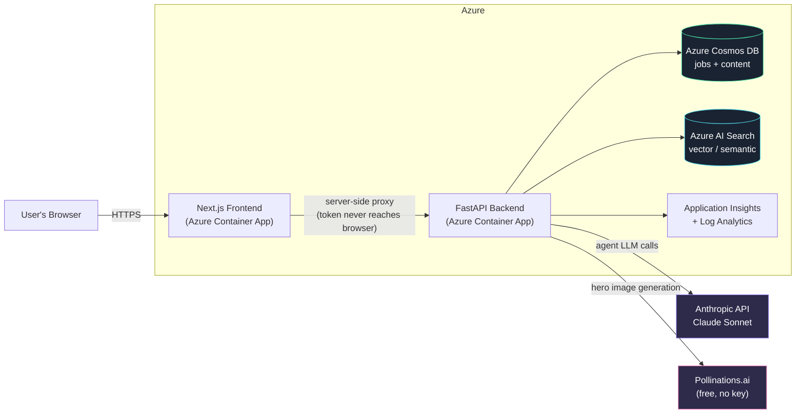
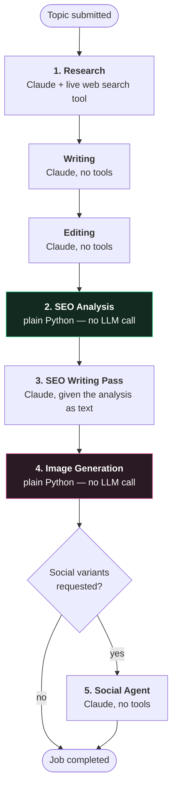
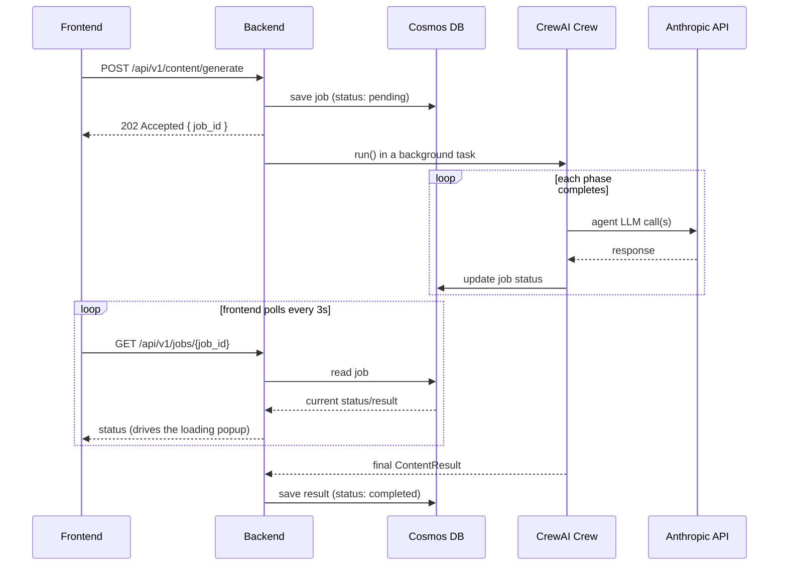
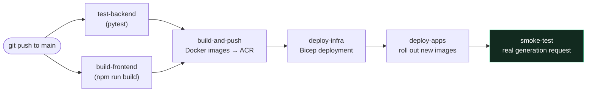

# AI Content Creation Pipeline

**CrewAI multi-agent system · Claude Sonnet · Azure**

Give it a topic. A crew of six AI agents researches it, writes it, edits it,
optimizes it for SEO, illustrates it, and repurposes it for social media —
end to end, no manual steps in between.

This README is written so that someone with **zero prior context** can clone
this repo and get it running, both locally and deployed to Azure. Every
step, every place to click, and every error we actually hit while building
this is documented below.

---

## Table of contents

1. [What this actually is](#1-what-this-actually-is)
2. [Architecture](#2-architecture)
3. [How a generation request flows through the system](#3-how-a-generation-request-flows-through-the-system)
4. [Repo layout](#4-repo-layout)
5. [Prerequisites](#5-prerequisites)
6. [Local development, step by step](#6-local-development-step-by-step)
7. [Manual Azure resource setup, step by step](#7-manual-azure-resource-setup-step-by-step)
8. [CI/CD via GitHub Actions, step by step](#8-cicd-via-github-actions-step-by-step)
9. [Where to find things in the Azure Portal](#9-where-to-find-things-in-the-azure-portal)
10. [Troubleshooting](#10-troubleshooting)
11. [Key design decisions](#11-key-design-decisions)

---

## 1. What this actually is

- **Backend**: FastAPI (Python) running a CrewAI crew of 6 agents, all powered by
  a single Claude Sonnet model.
- **Frontend**: Next.js 14 (App Router), dark themed, talks to the backend through
  its own server-side proxy routes.
- **Data**: Azure Cosmos DB stores job status and generated content. Azure AI
  Search is wired up for future semantic search over past content.
- **Images**: generated via Pollinations.ai (free, no API key) and served by the
  backend itself.
- **Deployment**: Azure Container Apps, provisioned by Bicep, deployed by a
  GitHub Actions pipeline that authenticates to Azure with no stored passwords
  (OIDC).

---

## 2. Architecture



**Nothing here is self-hosted for the LLM.** Earlier iterations of this project
ran a local Ollama model in its own Container App — that whole layer (model
downloads, memory tuning, Dedicated compute profiles) is gone. The backend
calls Anthropic's API directly.

---

## 3. How a generation request flows through the system

### 3.1 The five pipeline phases



Steps 2 and 4 are deliberately **not** LLM tool-calls. Early versions routed SEO
scoring and image generation through agent tool-calling, which turned out to be
unreliable — models would sometimes hallucinate a tool call as plain text
instead of actually invoking it. Since both of these are fully deterministic
(same input always produces the same kind of output), they're now just plain
Python function calls, and their results are handed to the next LLM step as
context. Only Research genuinely needs an LLM to decide what to search for.

### 3.2 Request/response sequence



---

## 4. Repo layout

```
content-pipeline/
├── backend/                        FastAPI + CrewAI (Python 3.11)
│   ├── app/
│   │   ├── main.py                 App entrypoint, static image serving
│   │   ├── config.py                All settings (pydantic-settings)
│   │   ├── agents/                  6 CrewAI agents — one shared Claude model
│   │   ├── crew/
│   │   │   ├── content_crew.py      5-phase orchestration + progress callbacks
│   │   │   └── tasks.py             Task prompts for each phase
│   │   ├── tools/                   web_search, seo_analyzer, image generation
│   │   ├── services/
│   │   │   ├── llm_service.py       Claude wiring + CrewAI bug workarounds
│   │   │   ├── cosmos_service.py
│   │   │   └── search_service.py
│   │   ├── api/routes/              health, content, jobs endpoints
│   │   ├── core/                    logging, exceptions, bearer-token auth
│   │   └── models/schemas.py        Pydantic request/response models
│   ├── tests/                       pytest suite (10 tests)
│   ├── requirements.txt
│   ├── Dockerfile
│   └── .env.example
├── frontend/                        Next.js 14 (App Router) + Tailwind
│   ├── app/                         /, /generate, /preview/[id]
│   ├── components/                  ContentForm, GenerateFlow, AgentRelay,
│   │                                 CrewLoadingScreen, ContentPreview, ...
│   ├── lib/                         agents.ts (shared metadata), api.ts
│   └── Dockerfile
├── infra/                           Bicep infrastructure-as-code
│   ├── main.bicep                   Orchestrator
│   ├── parameters.json
│   └── modules/
│       ├── monitor.bicep            Log Analytics + App Insights
│       ├── cosmosdb.bicep
│       ├── aisearch.bicep
│       └── containerapps.bicep      Container Apps env + backend + frontend
├── devops/
│   ├── setup-github-oidc.sh         One-time: Azure + GitHub OIDC setup
│   └── deploy.sh                    Manual/one-off deploy alternative
├── .github/workflows/ci-cd.yml      Test → build → deploy → smoke test
└── docker-compose.yml               Local dev: both apps together
```

---

## 5. Prerequisites

| Tool | Why | Get it |
|---|---|---|
| Python 3.11+ | Backend runtime | [python.org](https://www.python.org/downloads/) |
| Node.js 20+ | Frontend runtime | [nodejs.org](https://nodejs.org/) |
| Anthropic API key | Powers every agent | [console.anthropic.com/settings/keys](https://console.anthropic.com/settings/keys) |
| Azure CLI (`az`) | Only needed for Azure deployment | [Install guide](https://learn.microsoft.com/cli/azure/install-azure-cli) — **install via your OS package manager (e.g. Homebrew on Mac), never `pip install azure-cli` inside a project virtualenv** (breaks with paths containing spaces, and isn't how it's meant to be installed anyway) |
| An Azure subscription | Only needed for cloud deployment | [azure.microsoft.com/free](https://azure.microsoft.com/free/) |
| Docker (optional) | Only needed for `docker compose` local dev | [docker.com](https://www.docker.com/) |

---

## 6. Local development, step by step

### 6.1 Backend

```bash
cd backend
python3 -m venv .venv
source .venv/bin/activate              # Windows: .venv\Scripts\activate
python -m pip install --upgrade pip
python -m pip install -r requirements.txt
cp .env.example .env
```

Open `backend/.env` and set, at minimum:
```dotenv
ANTHROPIC_API_KEY=sk-ant-your-real-key-here
```

Run it:
```bash
python -m uvicorn app.main:app --reload
```

Check it worked:
```bash
curl http://localhost:8000/api/v1/health
# {"status":"ok","environment":"development","version":"1.0.0"}
```

API docs (interactive): http://localhost:8000/docs

> **Job history needs Cosmos DB.** Without `COSMOS_ENDPOINT`/`COSMOS_KEY` set,
> `POST /content/generate` will fail when it tries to save job state (see
> [Section 7.2](#72-cosmos-db--cosmos_endpoint--cosmos_key) for how to get
> those). To test generation without any Azure setup at all, use
> `POST /content/generate/sync` instead — it runs the crew inline and returns
> the full result directly, no database involved.

### 6.2 Frontend

```bash
cd frontend
npm install
cp .env.local.example .env.local
```

Open `frontend/.env.local`:
```dotenv
NEXT_PUBLIC_API_BASE_URL=http://localhost:8000/api/v1
BACKEND_API_TOKEN=change-me-local-dev-token
```

`BACKEND_API_TOKEN` must exactly match the backend's `API_AUTH_TOKEN` value
(also in `.env.example`, defaults to the same placeholder — fine for local dev,
just keep them identical).

```bash
npm run dev
```

Open http://localhost:3000 — you should see the dark-themed homepage with a
prompt bar and the six-agent relay diagram.

### 6.3 Or run both together with Docker Compose

```bash
cp backend/.env.example backend/.env    # fill in ANTHROPIC_API_KEY
docker compose up --build
```

### 6.4 Running the backend test suite

```bash
cd backend
pytest -v
```

All 10 tests should pass — they mock the LLM, database, and network calls, so
no API keys or Azure resources are needed to run them.

---

## 7. Manual Azure resource setup, step by step

Skip this whole section if you're going straight to [CI/CD](#8-cicd-via-github-actions-step-by-step)
— the pipeline provisions everything automatically. Use this section if you
want to click through the Portal yourself, or want real Azure services (Cosmos
DB, Azure AI Search) working during local development too.

### 7.1 Resource group

1. Azure Portal → search **"Resource groups"** → **+ Create**.
2. Pick your subscription, name it (e.g. `rg-content-pipeline-dev`), pick a
   region.
3. **Review + create**.

### 7.2 Cosmos DB → `COSMOS_ENDPOINT` / `COSMOS_KEY`

1. Search **"Azure Cosmos DB"** → **Create** → choose **Azure Cosmos DB for
   NoSQL**.
2. **Basics** tab: your resource group, a globally-unique account name, your
   region.
3. **Capacity mode: Serverless** — pay only per request, no minimum cost. This
   is what the whole project assumes; don't pick Provisioned throughput.
4. **Review + create**. Takes a few minutes.
5. Once deployed, open the resource.
6. Left sidebar → **Settings → Keys** (if you can't find this, see
   [Section 9](#9-where-to-find-things-in-the-azure-portal) — Microsoft
   reorganizes this blade fairly often).
7. Copy **URI** → this is `COSMOS_ENDPOINT`.
8. Copy **PRIMARY KEY** → this is `COSMOS_KEY`.

You do **not** need to manually create databases or containers — the backend
creates the `content_pipeline_db` database and `jobs`/`content` containers
itself on first use.

> ⚠️ **Region matters here.** Cosmos DB serverless account creation is
> capacity-restricted per region per subscription — some regions reject
> creation outright with a `ServiceUnavailable` / "high demand" error,
> especially on newer or Free Trial subscriptions. If that happens, retry in a
> different, well-established region — `westus2` and `eastus` have both been
> reliable in practice.

### 7.3 Azure AI Search → `AZURE_SEARCH_ENDPOINT` / `AZURE_SEARCH_API_KEY`

1. Search **"Azure AI Search"** → **Create**.
2. **Basics**: same resource group, a globally-unique lowercase name, your
   region.
3. **Pricing tier: Basic** (supports both semantic and vector search; Free tier
   also works for light testing but has lower limits).
4. **Review + create**.
5. Once deployed, the **Overview** page shows the URL:
   `https://<your-service-name>.search.windows.net` → this is
   `AZURE_SEARCH_ENDPOINT`.
6. **Settings → Keys** → copy the **Primary admin key** → this is
   `AZURE_SEARCH_API_KEY`.

> ⚠️ **Semantic Search isn't available in every region.** Some regions (South
> India, for example) reject it outright with
> `"Semantic Search is not available in '<region>' region"`. If you hit that,
> redeploy in a region from Microsoft's
> [supported-regions list](https://aka.ms/semanticsearchavailability) —
> `westus2`, `eastus`, and `westeurope` are all safe choices.

### 7.4 Application Insights (optional, for monitoring) → `APPLICATIONINSIGHTS_CONNECTION_STRING`

1. Search **"Log Analytics workspaces"** → **Create** (same resource
   group/region as everything else).
2. Search **"Application Insights"** → **Create**.
3. **Resource Mode: Workspace-based** → select the Log Analytics workspace you
   just created.
4. **Review + create**.
5. Open the resource → **Overview** page → **Connection String** is shown
   right near the top.

This is entirely optional — the backend just silently skips telemetry export
if this is left blank.

### 7.5 Anthropic API key → `ANTHROPIC_API_KEY`

Not an Azure resource. Go to
[console.anthropic.com/settings/keys](https://console.anthropic.com/settings/keys),
sign in, click **Create Key**, copy it immediately (you won't be able to see
it again).

### 7.6 Container Registry + Container Apps (manual deploy)

Rather than click through the Portal for this (Container Apps has a lot of
interlinked configuration — registry credentials, ingress, secrets, probes),
use the included script:

```bash
az login
chmod +x devops/deploy.sh
./devops/deploy.sh <resource-group> <location> <your-anthropic-api-key>
```

This creates the Container Registry, the Container Apps environment, and both
apps in one shot, building and pushing images via `az acr build`.

> ⚠️ **`az acr build` is blocked on Free Trial / student Azure subscriptions**
> with a `TasksOperationsNotAllowed` error — a subscription-tier restriction,
> not a bug in this script. If you hit that, either upgrade to Pay-As-You-Go,
> or build/push manually with plain Docker instead (see how the CI/CD
> pipeline does it in `.github/workflows/ci-cd.yml`'s `build-and-push` job —
> it works around this exact restriction).

---

## 8. CI/CD via GitHub Actions, step by step



### 8.1 One-time setup

```bash
az login
chmod +x devops/setup-github-oidc.sh
./devops/setup-github-oidc.sh <your-github-username-or-org> <your-repo-name> <azure-region>
```

Example: `./devops/setup-github-oidc.sh janedoe content-pipeline eastus`

This script is **safe to re-run** — every step checks whether something
already exists before trying to create it. It:

1. **Registers required Azure resource providers** (`Microsoft.App`,
   `Microsoft.DocumentDB`, `Microsoft.Search`, `Microsoft.ContainerRegistry`,
   etc.) — on newer/Free Trial subscriptions these often aren't
   auto-registered, which causes a `MissingSubscriptionRegistration` error the
   first time you deploy anything.
2. **Creates the resource group and Azure Container Registry.**
3. **Creates an Azure AD app registration with OIDC federated credentials** —
   GitHub Actions authenticates to Azure using short-lived tokens exchanged at
   runtime. No password or client secret is ever stored in GitHub.
4. **Grants that app Contributor**, scoped to just the resource group (not
   your whole subscription).
5. **Prints everything you need** for step 8.2 below.

> ⚠️ **If your GitHub repo was created after July 15, 2026**, GitHub uses a
> newer "immutable subject" OIDC token format that embeds numeric owner/repo
> IDs instead of just names. This script creates federated credentials for
> *both* the old and new formats automatically, so you shouldn't need to do
> anything extra. If you ever see
> `AADSTS700213: No matching federated identity record found`, the error
> message itself shows the exact subject string GitHub sent — you can add a
> matching federated credential manually with that exact value if the
> automatic detection somehow missed your case.

### 8.2 GitHub secrets

Go to your repo → **Settings → Secrets and variables → Actions → New
repository secret**, and add all five:

| Secret | Where the value comes from |
|---|---|
| `AZURE_CLIENT_ID` | Printed by `setup-github-oidc.sh` |
| `AZURE_TENANT_ID` | Printed by `setup-github-oidc.sh`, or run `az account show --query tenantId -o tsv` |
| `AZURE_SUBSCRIPTION_ID` | Printed by `setup-github-oidc.sh`, or run `az account show --query id -o tsv` |
| `API_AUTH_TOKEN` | Printed by `setup-github-oidc.sh` (it generates a random one for you) |
| `ANTHROPIC_API_KEY` | You get this yourself — [console.anthropic.com/settings/keys](https://console.anthropic.com/settings/keys) |

**To confirm what's currently set:** Settings → Secrets and variables →
Actions → Repository secrets. GitHub never shows secret *values* back to you,
but it lists the *names* — you should see exactly these five.

### 8.3 GitHub Environment

Settings → **Environments** → **New environment** → name it exactly
`production` (several jobs in the workflow reference this exact name).
Optionally add required reviewers here if you want a manual approval gate
before every deploy.

### 8.4 What each pipeline stage actually does

| Stage | What happens |
|---|---|
| `test-backend` / `build-frontend` | Run on every push and PR — pytest, and `npm run build` |
| `build-and-push` | Builds both Docker images, pushes to ACR using plain `docker build`/`push` (not `az acr build` — see the Free Trial restriction note above) |
| `deploy-infra` | Resolves each region-sensitive resource's *actual current region* before deploying (a resource's Azure region is immutable — you can't just redeploy it somewhere else), then runs the Bicep deployment |
| `deploy-apps` | Rolls out the newly-built images to the backend/frontend Container Apps |
| `smoke-test` | Waits for the backend to report healthy, then sends a **real** generation request through `/content/generate/sync` — this proves the Anthropic API key actually works and a full crew run completes, not just that the container started |

---

## 9. Where to find things in the Azure Portal

A quick-reference for spots that moved or aren't obvious in the current Portal
layout:

| Looking for... | Go to |
|---|---|
| A resource's access keys (Cosmos, Search, Storage) | Resource → left sidebar → **Settings → Keys**. If not there, it may be under **Security + networking** instead — use the in-blade search box at the top of the resource page and type "keys" to jump straight to it regardless of where it's nested. |
| Live container logs | Resource (Container App) → **Monitoring → Log stream** |
| Whether a container is crash-looping | Resource (Container App) → **Application → Revisions and replicas** — look at "Running status" and restart count |
| A shell inside a running container | Resource (Container App) → **Application → Console** |
| A Container App's public URL | Resource → **Overview** page → **Application Url** field |
| Your Azure Tenant ID | Run `az account show --query tenantId -o tsv`, or Portal → search "Microsoft Entra ID" → Overview page |
| Whether a GitHub Actions deploy actually succeeded | Your repo → **Actions** tab → click the run → each job/step shows green/red with full logs |

---

## 10. Troubleshooting

Every one of these is a **real issue** hit while building this project, not a
hypothetical — documented here so you don't have to rediscover the fix.

### "MissingSubscriptionRegistration" during deployment
Your subscription hasn't auto-registered a required resource provider yet
(common on newer/Free Trial subscriptions). Run:
```bash
az provider register --namespace Microsoft.ContainerRegistry
# swap the namespace for whichever one the error names
```
`setup-github-oidc.sh` registers all of these proactively, so this shouldn't
come up if you used the script.

### "TasksOperationsNotAllowed" from `az acr build`
Confirmed, well-documented restriction on Azure Free Trial / student
subscriptions — ACR Tasks is blocked entirely. Either upgrade to
Pay-As-You-Go, or build/push with plain Docker instead (which is what the
GitHub Actions pipeline already does, specifically to avoid this).

### "InvalidResourceLocation" / a resource "already exists in location X"
A resource's Azure region is **immutable** once created — you cannot redeploy
it into a different region. The GitHub Actions pipeline handles this
automatically by checking each resource's actual current region before
deploying and reusing it. For a manual deploy, either delete the resource
first (`az resource delete ...`) or update your parameters to match its
existing region.

### "Semantic Search is not available in '<region>' region"
Not every Azure region supports Semantic Search. Redeploy Azure AI Search in
a supported region (`westus2`, `eastus`, `westeurope` are safe) — see
[Section 7.3](#73-azure-ai-search--azure_search_endpoint--azure_search_api_key).

### "ServiceUnavailable...currently experiencing high demand" (Cosmos DB)
Cosmos DB serverless account creation is capacity-restricted per
region-per-subscription. Try a different, more established region.

### "ContainerAppInvalidResourceTotal" — invalid CPU/memory combo
Azure Container Apps' Consumption plan only allows specific fixed CPU:memory
ratios (e.g. `1.0 CPU`/`2.0Gi`, `2.0 CPU`/`4.0Gi` — never arbitrary values).
The error message itself lists every valid combination — pick one from that
list.

### `AADSTS700213: No matching federated identity record found`
GitHub's OIDC subject claim format changed for repos created after July 15,
2026 (adds numeric owner/repo IDs). `setup-github-oidc.sh` handles both
formats — if you still see this, the error message shows the *exact* subject
GitHub sent; add a federated credential matching that exact string.

### `ImportError: cannot import name 'CosmosClient' from 'azure.cosmos'`
Usually means `azure-cosmos` didn't install cleanly, or something is
shadowing the `azure` namespace package. Fix:
```bash
pip uninstall azure-cosmos azure -y
pip install --no-cache-dir azure-cosmos==4.7.0
python -c "from azure.cosmos import CosmosClient; print('OK')"
```

### `bad interpreter` error running `az` inside a virtualenv
Azure CLI should **never** be installed via `pip install azure-cli` inside a
project virtualenv — it's meant to be a standalone system tool. This error
specifically happens when the venv's path contains a space (pip-installed
console scripts embed the full interpreter path in their shebang line, which
breaks on spaces). Fix: `pip uninstall azure-cli -y`, then install it properly
via your OS package manager (e.g. `brew install azure-cli` on Mac).

### Agent execution / event loop errors: `"Agent execution was invoked synchronously from within a running event loop"`
CrewAI's newer Flow-based execution calls `asyncio.run()` internally. Calling
`crew.run()` directly from inside an `async def` FastAPI route nests that
inside the route's already-running event loop, which Python disallows. Fix:
run it in a worker thread instead —
```python
result = await asyncio.to_thread(crew.run)
```
(already applied in `backend/app/api/routes/content.py`'s `/generate/sync`
endpoint).

### `Error code: 400 - This model does not support assistant message prefill`
A real CrewAI + Claude 4.6+/Sonnet 5 incompatibility: when an agent hits its
`max_iter` limit, CrewAI tries to force a final answer by ending the
conversation on an assistant-role message — a technique Claude explicitly
rejects for these newer models. This is already patched around in
`backend/app/services/llm_service.py` (appends a trailing user-role message so
the conversation always ends correctly). If you ever see this error again, it
likely means a *different* code path in CrewAI is doing the same thing —
paste the full traceback and trace it the same way.

### Ollama-specific issues (only relevant if you're using an older, local-Ollama version of this project)
This version of the project calls Anthropic's API directly and has no
self-hosted model — none of the old Ollama memory/download/OOM issues apply
here. If you're looking at an older revision of this repo that still uses
Ollama, that's a different, now-retired architecture.

---

## 11. Key design decisions

- **One Claude model for every agent.** Earlier local-model iterations needed
  a tool-calling-capable model split from a separate writing/reasoning model,
  since small local models weren't reliably good at both. Claude Sonnet
  handles tool-calling and long-form writing well enough that one model for
  everything is simpler and doesn't trade off quality.
- **Deterministic work stays in Python, not LLM tool calls.** SEO scoring and
  image generation are both plain function calls, never something an agent
  "decides" to invoke — more reliable, faster, and cheaper.
- **Async job model.** `POST /content/generate` returns a `job_id`
  immediately (202) and runs the crew in a background task, since a full run
  can take anywhere from 30 seconds to a couple of minutes. The frontend polls
  every few seconds; `ContentCrew` fires a real status update as each phase
  actually completes, so progress shown is genuine, not a guess.
- **The backend token never reaches the browser.** The Next.js app proxies
  through its own server-side route handlers.
- **Multi-tenant partitioning.** Cosmos containers are partitioned by
  `/tenant_id`, ready to scale to multiple customers/workspaces later.
- **OIDC over stored credentials.** GitHub Actions never holds a long-lived
  Azure password — it exchanges a short-lived OIDC token for an Azure access
  token on every run.
